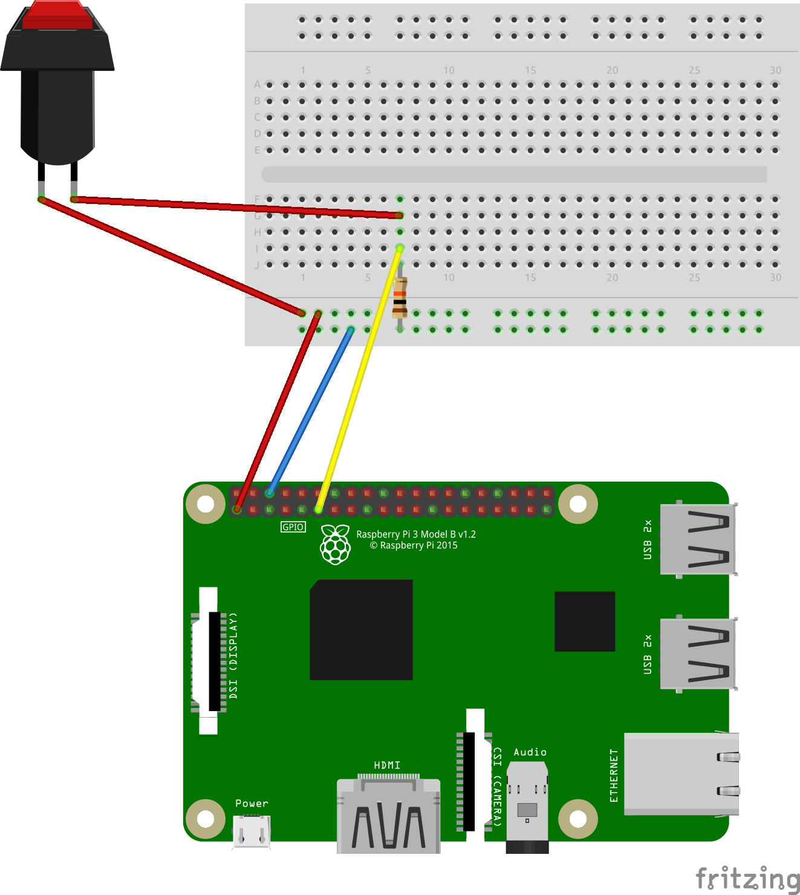

<p align="center">
  <a href="https://github.com/fwiedmann/icof">
    
  </a>

<h3 align="center">icof</h3>

  <p align="center">
     in case of fire
  </p>
</p>


Due to the ongoing global pandemic I started to work mostly from home.
Beside my job as a software engineer I am also a volunteer firefighter in my local community.
This means that I'm on call for emergencies 24/7, also during my daily work as a SE.
When I am in the office and get a call, I can speak to my colleagues in seconds that I have to go (Or they just see me running to my car).
In booth cases they are informed that I am afk and can probably re-schedule or take over meetings for me.
When working from home I want to send an absence notification to my colleagues.
Chatting my 2-4 colleagues can be time-consuming.
Well, I am an engineer. I can automate this in combination with a big red button. I like big red buttons.


# gocrazy installation

First you need to plug-in the Pi SD card into your PC. If you have already installed an OS like raspbian on this SD card, I recommend flashing it.
With the `fdisk` utility you can delete all existing partitions and create a new one for the whole capacity.
Go-krazy will overwrite the whole partitions, but I needed this step in order to install go-krazy.

Now you can follow the go-krazy installation guide: https://github.com/gokrazy/gokrazy#installation

```bash
gokr-packer -update yes -hostname 192.168.178.47 -serial_console=disabled .
```

## Circuit 

The circuit uses a pull down resistor. This will pull down the input signal at the GPIO pin to LOW if the switch is pressed and the power circuit is interrupted. 

- Emergency switch is wired in NC (normally closed).
- A 10kΩ resistor is used
- 3,3V power pin is enough



